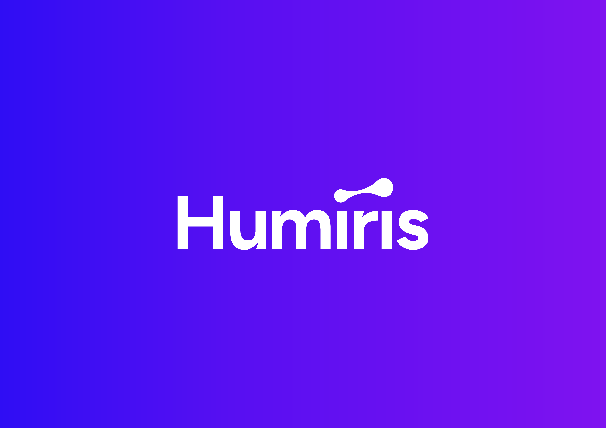

Humiris offers a multi-LLM routing and reasoning layer for optimizing Generative AI workflows with a flexible, scalable infrastructure. This allows you to leverage multiple AI models based on specific goals, such as accuracy, speed, cost, energy use, and privacy.

### Key Features

1. **Humiris Routing**: A powerful, large-scale routing model that automatically selects the optimal LLM based on your requirements.

2. **Humiris Reasoning**: A customizable reasoning model to develop a tailored mix-model, enhancing performance beyond single models.

3. **Flexible Infrastructure Options**:

   * **SaaS**: Instant setup, ideal for startups.

   * **Private Instance**: Enhanced privacy and control.

   * **Self-hosted**: Full data sovereignty and scalability for regulated industries.