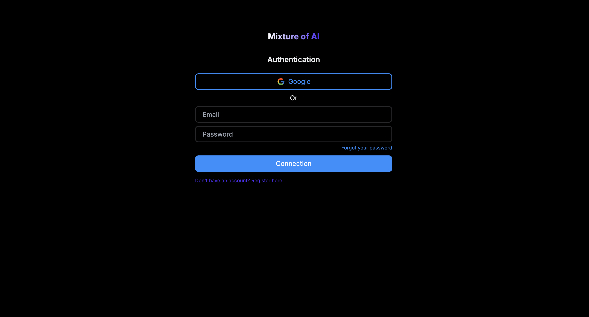
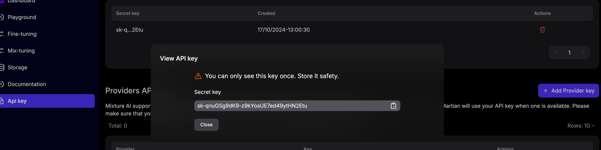
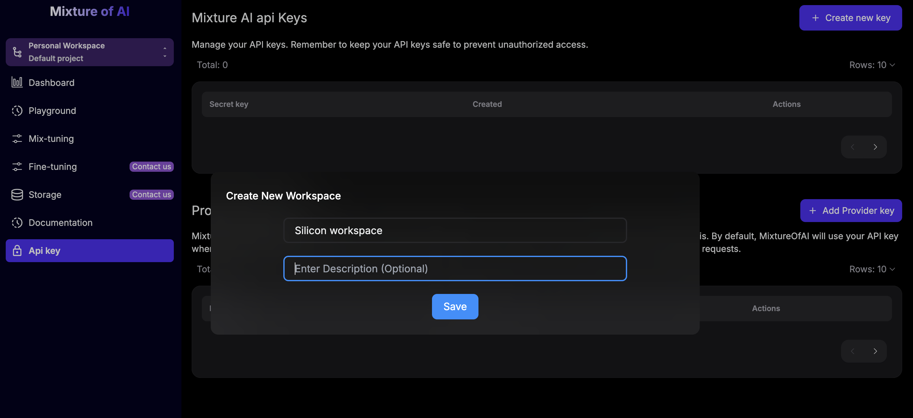
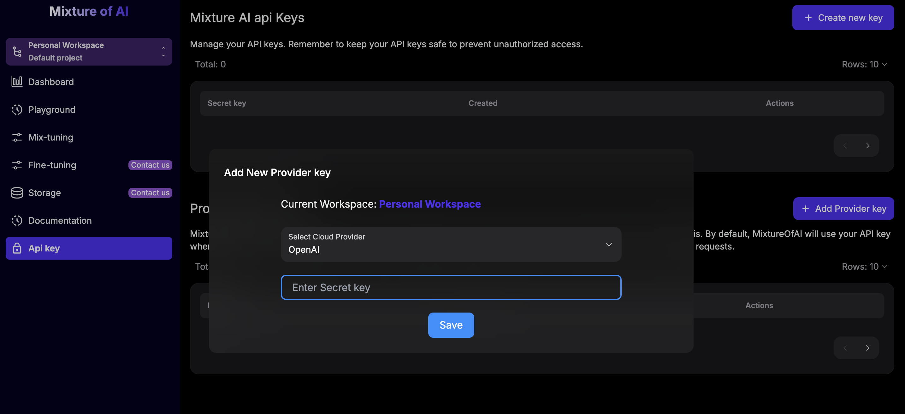
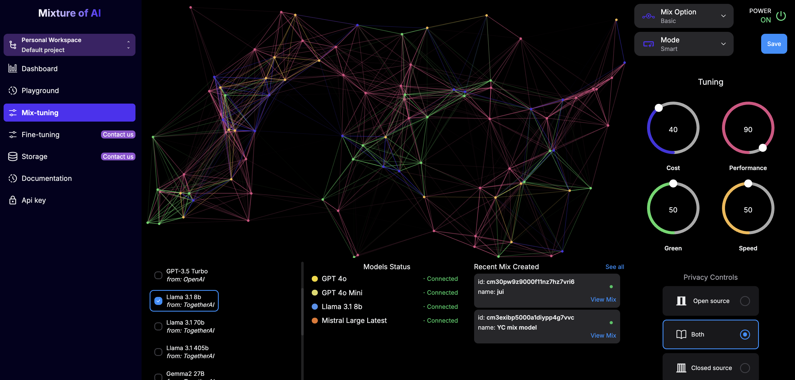
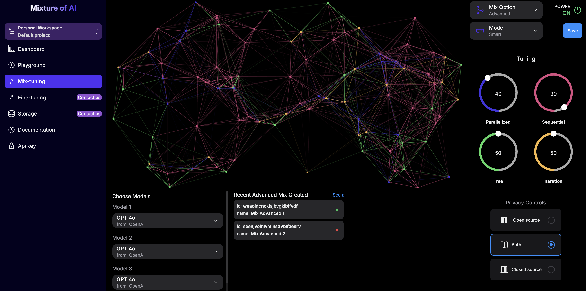

## 1.  Register for an account

Go to [Humiris](https://www.platform.humiris.ai) and sign up to create an account.



## 2. Create your first project

Go to [Humiris](https://www.platform.humiris.ai) and sign up to create an account.

Before we start make sure that you [create an account here](https://platform-moai-git-main-joe-ai.vercel.app/).

After creating your account you will have a default project and workspace.



Your project is linked to your workspace. All your data (API Keys, Models, etc.) are organized according to your workspace.

This allows you to manage your projects independently and add collaborators.



Upon creating your account, you will be added to your default workspace and project. After that, you can create your own workspaces and projects.


## 3. Create your API key

Create it in the "API Key" section by clicking on the "Create New Key" button.

.avif)

After that, we will generate a secure key for you that will help you connect to our platform with complete security.

.avif)

We're all set. We can now dive deeper.

## 4. Add your LLMs providers API Keys

Obtain API keys from your chosen LLM providers (e.g., OpenAI, Anthropic).&#x20;

*If you don’t have an account on their platform, you must sign up and create API keys.*

**Copy the Key**: After generating, copy the API key to use in your Humiris configuration.



## 5. Mix your models

Choose the type of mixture you want to create: Basic or Advanced.
The Basic option optimizes for preferences like speed, cost, energy efficiency, quality, and privacy.
The Advanced option allows you to mix models based on a reasoning architecture.
Select the models you wish and mix them using tuning parameters until you achieve the perfect mix-model

Basic mixture



Advanced mixture



## 6. Make your first API request

<CodeGroup>
  ```javascript Python

  from openai import Humiris
  client = Humiris()
  completion = client.chat.completions.create(
      model="mix-model",
      messages=[
          {"role": "user", "content": "what's the capital of France"}
            ]
    
  ```

  ```
  import Together from 'together-ai';

  const together = new Together();

  const stream = await together.chat.completions.create({
    model: 'meta-llama/Meta-Llama-3.1-8B-Instruct-Turbo',
    messages: [
      { role: 'user', content: 'What are some fun things to do in New York?' },
    ],
    stream: true,
  });

  for await (const chunk of stream) {
    // use process.stdout.write instead of console.log to avoid newlines
    process.stdout.write(chunk.choices[0]?.delta?.content || '');
  }
  ```

  ```
  curl https://api.openai.com/v1/chat/completions
  -H "Content-Type: application/json"
  -H "Authorization: Bearer $OPENAI_API_KEY"
  -d '{
          "model": "gpt-4o",
          "messages": [
              {"role": "user", "content": "write a haiku about ai"}
          ]
      }'
  ```
</CodeGroup>